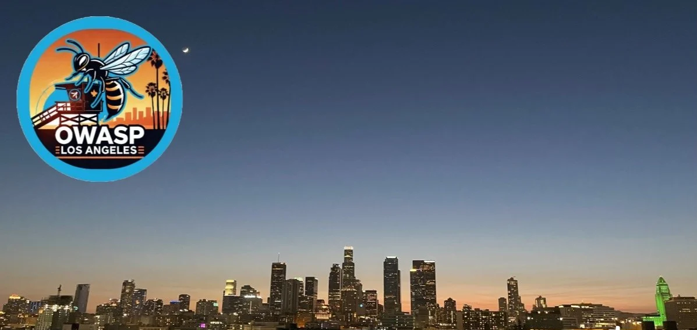
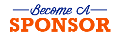
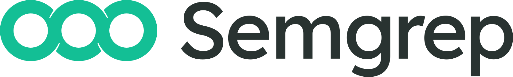
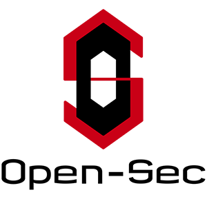
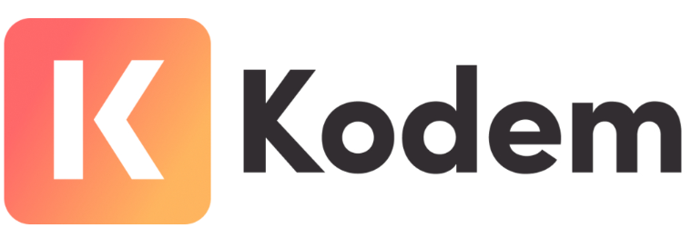
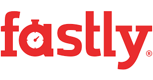
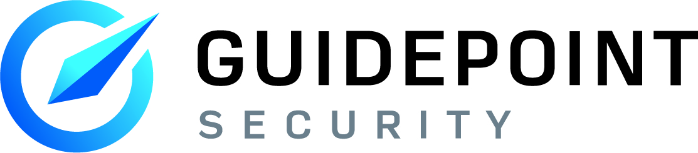
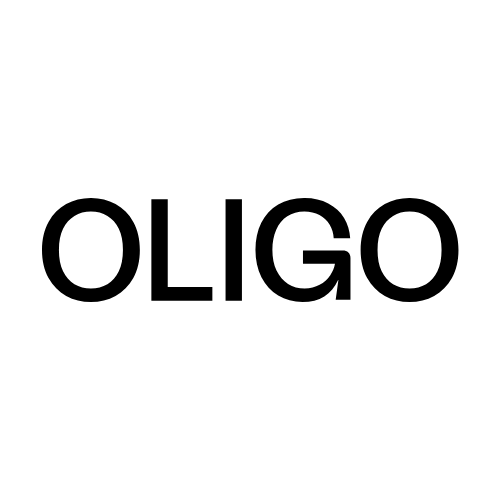

---

layout: col-sidebar
title: OWASP Los Angeles
tags: Events-tag
level: 0

region: North America
country:  USA
Luma-group: OWASP-Los-Angeles
---
## Welcome

Welcome to the OWASP [LA](https://en.wikipedia.org/wiki/Los_Angeles) Chapter home page.

> **Note:** Some community members search for OWASP LA as "OWASPLA" (all one word). Don't worry you're in the right place!
<!-- Including "owaspla" here helps search engines recognize it as an alternate spelling of OWASP LA -->

The OWASP Los Angeles chapter typically meets on the 4th Wednesday every month (except November) for dinner. We feature a great security related speaker on an AppSec topic. Join us for a great opportunity to network before and after the talk, while enjoying amazing local food and drinks.

## 

Meet upwards of 70–80 potential new clients. Be recognized as a local supporter by:

- Posting your company logo on the local chapter page and on our Luma event listings
- Having your marketing write up included in email blasts sent prior to monthly meetings
- Having a table at the local chapter meeting with lots of time to meet and greet attendees
- Promoting your products and services
- Bringing a raffle prize to gather business cards and contact information

[OWASP LA Sponsorship Prospectus v1.4](assets/OWASP-LA-Sponsorship-Prospectus-v1.4-2026.pdf)

[OWASPLA Photos](assets/OWASPLA_prez_2025_photos.pdf)

[Speaker and Sponsorship Calendar & Availability](https://docs.google.com/spreadsheets/d/e/2PACX-1vS8IYQkXRLIihDegB7-WHpU4F5mDWqDH8jCWcOEg7Sugb1J9uiXBS0o0Ny4j8_KDwbx6nBaCsNGZbak/pub?gid=1956382240&single=true&output=pdf)

Contact us for detail via [sponsorship.la@owasp.org](mailto:sponsorship.la@owasp.org)

## Events

We are on Luma. For the list of latest events and to register please join our community [lu.ma/owaspla](https://lu.ma/owaspla)

## Monthly Sponsors

### Platinum (Hybrid Sponsor – Virtual + In-Person)

  

    
April 2026

    
  

  
   

    
June 2026

    
  

### Gold (In-Person Sponsor)

  

    
January 2026

    
  

  

    
February 2026

    
  

  

    
May 2026

    
  

  
  

    
June 2026

    
  

### Silver (Virtual Sponsor)

  

    
March 2026

    
  

  

## Participation

OWASP is a not-for-profit, worldwide organization focused on improving the security of all software. Our mission is to improve software security through Open Source initiatives and community education. Everyone is free to participate in OWASP and all of our materials are available under a free and open software license.

The OWASP Los Angeles chapter was formed in 2008 by [Cassio Goldschmidt](https://linkedin.com/in/cassiogoldschmidt).

We hold meetups on the 4th Wednesday of every month, featuring great speakers on important application security topics. Join us for food, drinks, and to network with your peers and get a better understanding of challenges with application security.

Support OWASP Projects and your LA Chapter by becoming an OWASP Member TODAY [owasp.org/membership](https://owasp.org/membership): only **$50** for the entire year! ($20 if you're a student)

