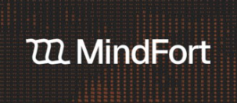

---

layout: col-sidebar
title: OWASP Los Angeles
tags: Events-tag
level: 0

region: North America
country:  USA
Luma-group: OWASP-Los-Angeles
---

<!-- ============================================================
     WELCOME SECTION
     Main intro for the OWASP LA chapter home page.
     ============================================================ -->
<h2>Welcome</h2>

  Welcome to the OWASP
  <a href="https://en.wikipedia.org/wiki/Los_Angeles" target="_blank" rel="noopener noreferrer">LA</a>
  Chapter home page.

<!-- Blockquote used for the OWASPLA note; also helps search engines
     recognize "OWASPLA" as an alternate spelling of OWASP LA -->
<blockquote>
  <strong>Note:</strong> Some community members search for OWASP LA as "OWASPLA" all one word.
  Don't worry, you're in the right place!
</blockquote>

  The OWASP Los Angeles chapter brings together security professionals, developers, students,
  researchers, and community members interested in application security, API security, AI security,
  cloud security, and secure software development.

  We typically host monthly AppSec community events, including in-person meetings, virtual talks,
  and quarterly hands-on workshops.

  Our in-person meetings are usually held on the 4th Wednesday of each month, except November.
  These events often include dinner, networking, and a security-related speaker presenting on an
  AppSec topic.

  Join us for an opportunity to learn, network, and connect with the local cybersecurity community.

<!-- ============================================================
     SPONSORSHIP SECTION
 
     ============================================================ -->
<h2>Become a Sponsor</h2>

<!-- Sponsor banner image displayed below the heading -->

  

  Support the OWASP LA community and connect with 70–80 potential attendees, including security
  professionals, developers, students, and technology leaders.

Sponsors may be recognized through:

<ul>
  <!-- Each benefit is a separate list item for clarity and readability -->
  <li>Posting your company logo on the local chapter page and on our Luma event listings</li>
  <li>Having your marketing write-up included in email blasts sent prior to monthly meetings</li>
  <li>Having a table at local chapter meetings, when available</li>
  <li>Promoting your products and services</li>
  <li>Bringing a raffle prize to engage with attendees</li>
</ul>

<!-- ============================================================
     SPONSORSHIP LINKS SECTION
     Key resources for prospective and current sponsors.
     ============================================================ -->
<!-- Resource links styled as buttons for visual clarity -->

  <!-- Sponsorship prospectus PDF – update version number and file name each year -->
  <a href="assets/OWASP-LA-Sponsorship-Prospectus-v1.4-2026.pdf" target="_blank"
     style="display:inline-block; padding:10px 16px; background:#005a8e; color:#fff; border-radius:6px; text-decoration:none; font-size:14px; font-weight:bold;">
    📄 Sponsorship Prospectus
  </a>

  <!-- Chapter event photos PDF -->
  <a href="assets/OWASPLA_prez_2025_photos.pdf" target="_blank"
     style="display:inline-block; padding:10px 16px; background:#005a8e; color:#fff; border-radius:6px; text-decoration:none; font-size:14px; font-weight:bold;">
    📸 Event Photos
  </a>

<!-- Live Google Sheet exported as PDF showing speaker and sponsor availability -->
  <a href="https://docs.google.com/spreadsheets/d/e/2PACX-1vS8IYQkXRLIihDegB7-WHpU4F5mDWqDH8jCWcOEg7Sugb1J9uiXBS0o0Ny4j8_KDwbx6nBaCsNGZbak/pub?gid=1956382240&single=true&output=pdf" target="_blank" download="OWASPLA-Speaker-Sponsor-Calendar-2026.pdf"
     style="display:inline-block; padding:10px 16px; background:#005a8e; color:#fff; border-radius:6px; text-decoration:none; font-size:14px; font-weight:bold;">
  📅 Speaker &amp; Sponsorship Calendar
</a>

<!-- Sponsorship inquiry email – kept as plain text for visibility -->

Contact us for details via <a href="mailto:sponsorship.la@owasp.org">sponsorship.la@owasp.org</a>

## Events
<!-- Events section: directs visitors to the OWASP LA Lu.ma community page -->

We are on Lu.ma. For the latest OWASP Los Angeles events and registration, please join our community: [lu.ma/owaspla](https://lu.ma/owaspla)

  

    <h3>Upcoming June Workshop</h3>

    <iframe
      src="https://luma.com/embed/event/evt-3yRfTRG328ZaOfX/simple"
      width="600"
      height="650"
      frameborder="0"
      style="width:100%; border: 1px solid #bfcbda88; border-radius: 4px;"
      allow="fullscreen; payment"
      aria-hidden="false"
      tabindex="0"
    ></iframe>
  

  

    <h3>Upcoming June In-Person Meeting</h3>

    <iframe
      src="https://luma.com/embed/event/evt-3gbNKevdVXH4S70/simple"
      width="600"
      height="650"
      frameborder="0"
      style="width:100%; border: 1px solid #bfcbda88; border-radius: 4px;"
      allow="fullscreen; payment"
      aria-hidden="false"
      tabindex="0"
    ></iframe>
  

<!-- Monthly Sponsors section -->
## Monthly Sponsors

<!-- Platinum sponsors: hybrid sponsorship includes virtual and in-person visibility -->
### Platinum (Hybrid Sponsor – Virtual + In-Person)

<!-- Sponsor logo container: flex layout keeps logos responsive and aligned -->

  <!-- April 2026 Platinum Sponsor: Semgrep -->
  

    
April 2026

    
  

    <!-- May 2026 Platinum Sponsor: OpenSec -->
   

    
May 2026

    
  

<!-- Gold sponsors: in-person sponsorship visibility -->
### Gold (In-Person Sponsor)

<!-- Gold sponsor logo container -->

  <!-- January 2026 Gold Sponsor: Kodem -->
  

    
January 2026

    
  

  <!-- February 2026 Gold Sponsor: Fastly -->
  

    
February 2026

    
  

  
<!-- May 2026 Gold Sponsor: GuidePoint Security -->
  

    
May 2026

    
  

   <!-- June 2026 Gold Sponsor: Oligo Security -->
  

    
June 2026

    
  

   <!-- June 2026 Gold Sponsor: MindFort -->
  

    
June 2026

    
  

  

<!-- Silver sponsors: virtual sponsorship visibility -->
### Silver (Virtual Sponsor)

<!-- Silver sponsor logo container -->

  <!-- March 2026 Silver Sponsor: Answer Strategic Consulting -->
  

    
March 2026

    
  

  

## Participation

OWASP is a not-for-profit, worldwide organization focused on improving the security of all software. Our mission is to improve software security through Open Source initiatives and community education. Everyone is free to participate in OWASP and all of our materials are available under a free and open software license.

The OWASP Los Angeles chapter was formed in 2008 by [Cassio Goldschmidt](https://linkedin.com/in/cassiogoldschmidt).

We hold meetups on the 4th Wednesday of every month, featuring great speakers on important application security topics. Join us for food, drinks, and to network with your peers and get a better understanding of challenges with application security.

Support OWASP Projects and your LA Chapter by becoming an OWASP Member TODAY [owasp.org/membership](https://owasp.org/membership): only **$50** for the entire year! ($20 if you're a student)

